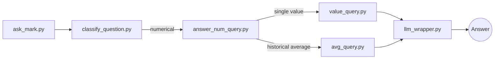

## 1. Introduction

**Mark – Your Personal AI Investment Assistant** is an intelligent financial assistant designed to provide accurate answers to user queries regarding financial markets and company fundamentals. This project serves as a university assignment but aspires to simulate the architecture of a production-grade AI system, combining structured financial data with natural language processing and Retrieval-Augmented Generation (RAG).

Mark is designed with the primary objective of helping users—such as investors, analysts, or students—query a vast database of U.S. publicly traded companies and receive informative, source-based answers in natural language. The assistant currently supports two core functionalities:

1. **Numerical Querying via Yahoo Finance**  
   Mark extracts and continuously updates structured financial and market data from Yahoo Finance for over 10,000 U.S.-listed companies. These data are stored in a normalized MySQL database, which supports fast and efficient SQL querying. When a user submits a question such as *"What was Apple's average stock price in 2022?"*, the system parses the query, extracts relevant entities (company, metric, time period), and generates an appropriate SQL query to fetch the result. The value is then passed through a response wrapper that contextualizes it into a natural, human-readable answer.

2. **Textual Question Answering via SEC Filings (10-K, 10-Q)**  
   In parallel, Mark allows users to ask qualitative questions based on official company disclosures. The system automatically downloads HTML-formatted 10-K and 10-Q reports from the SEC's EDGAR database, cleans and processes the documents, splits them into semantically meaningful chunks, embeds them into a FAISS vector store, and enables semantic search through a RAG pipeline. When a question is asked—e.g., *"What does the latest 10-K of Amazon say about risk factors?"*—Mark retrieves the most relevant text blocks and constructs an answer based entirely on official sources.

The system is modular and extensible, designed around a clean pipeline structure. The core orchestrator is the script `ask_mark.py`, which routes the user question to either the **numerical pipeline**, the **textual pipeline**, or a **hybrid path** depending on the nature of the query. Each component—classification, parsing, querying, retrieval, and response generation—has been implemented as an isolated, testable module.

Mark is deployed on a VPS environment, and its database is kept up to date via scheduled tasks (`crontab`) that ensure real-time accuracy of market and fundamental data. The user interface is exposed through a lightweight Streamlit web application, allowing anyone with browser access to interact with the assistant in real-time.

This README serves as a comprehensive guide for understanding, installing, deploying, and using the Mark assistant. Whether you're running the system locally or hosting it on a server, all necessary steps are detailed below.


## 2. Mark Pipeline Architecture  
```
                ┌───────────────────┐
                │   ask_mark.py     │ ← receives user question
                └─────────┬─────────┘
                          │
                ┌─────────▼─────────────┐
                │ classify_question.py  │ ← decides query type
                └───────┬───────┬───────┘
                        │       │
           ┌────────────▼─┐   ┌─▼───────────────┐
           │   Numerical  │   │     Textual     │
           │     Query    │   │      Query      │
           │(YahooFinance)│   │ (EDGAR Reports) │
           └──────┬───────┘   └──────┬──────────┘
                  │                  │
         ┌────────▼──────────┐ ┌─────▼──────────────┐
         │answer_num_query.py│ │answer_text_query.py│
         │     (routing)     │ └──────────────────┬─┘
         └─────┬───────┬─────┘                    │
               │       │                          │
┌──────────────▼───┐┌──▼───────────────┐          │
│parse_num_query.py││parse_avg_query.py│          │
│     (single)     ││    (averages)    │          │
└──────┬───────────┘└──────┬──────────┘           │
       │                   │                      │
┌──────▼────────┐ ┌────────▼───────┐  ┌───────────▼──────────┐
│value_query.py │ │avg_query.py    │  │    retriever.py      │
│ (SQL queries) │ │(SQL queries)   │  │   (semantic RAG)     │
└──────┬────────┘ └───────┬────────┘  └───────────┬──────────┘
       │                  │                       │
       │                  │                       │
       └──────────────────┴─┬─────────────────────┘
                            │
                            │               
               ┌────────────▼──────────────┐
               │       llm_wrapper.py      │
               │      (response LLM)       │
               └────────────┬──────────────┘
                            │
               ┌────────────▼────────────┐
               │      Final Answer       │ ← returned to user
               └─────────────────────────┘
```

## 3. Installation & Setup

### 3.1 Requirements

| **Operating System** | Ubuntu 20.04 LTS (tested on macOS 15) |
| -------------------- | ------------------------------------- |
| **Python**           |           3.10+                       |
| **MySQL**            |           8.0                         |
|                      |                                       |

> **Tip:** For a full 10 000‑ticker mirror, allocate at least **4 vCPU** and **8 GB RAM**.

---

### 3.2 Creating the Environment

```bash
git clone https://github.com/<your-username>/mark-ai-assistant.git
cd mark-ai-assistant

# Isolated virtual environment
python -m venv .venv
source .venv/bin/activate

# CPU‑only install
pip install -r requirements.txt
# or, for the full development stack (docs, linting, tests):
pip install -r requirements_full.txt
```

---

### 3.3 Configuring `.env`

1. Copy the template:

   ```bash
   cp .env.template .env
   ```

2. Fill in the variables:

   | Variable                                       | Description                                   |
   | ---------------------------------------------- | --------------------------------------------- |
   | `DB_HOST`, `DB_USER`, `DB_PASSWORD`, `DB_PORT` | MySQL credentials                             |
   | `OPENAI_API_KEY`                               | Your personal **super‑key** for OpenAI models |

3. Example snippet:

   ```ini
   # Database
   DB_HOST=localhost
   DB_PORT=3306
   DB_USER=mark_admin
   DB_PASSWORD=strong_password

   # OpenAI
   OPENAI_API_KEY=sk-XXXXXXXXXXXXXXXXXXXXXXXXXXXXXXX
   ```

`python-dotenv` loads the file automatically at runtime. In production the file usually lives in `$HOME/mark_ai/.env`.

---

### 3.4 Starting the MySQL Server

Ensure the MySQL daemon is running **before** you attempt to create the schema or populate data.

```bash
# Ubuntu 20.04+ (systemd)
sudo systemctl start mysql

# macOS (Homebrew)
brew services start mysql
```

Check the status:

```bash
# Linux
sudo systemctl status mysql

# macOS
brew services list | grep mysql
```

With the database server online, you’re ready to move on to [**4. Database Creation & Population**](#4-database-creation--population).

---

### 3.5 Provisioning the VPS (RackNerd KVM)

The data‑collection pipeline is designed to run on a modest VPS. In production we use a **RackNerd KVM** instance with the following profile:

| Resource | Value                   |
| -------- | ----------------------- |
| vCPU     | 5 dedicated cores       |
| RAM      | 6 GB                    |
| Storage  | 170 GB RAID‑10 SSD      |
| Network  | 1 Gbps unmetered        |
| OS       | Ubuntu 22.04 LTS 64‑bit |

> **Capacity note:** With three `update_mark_db.py` (we will see it in the next section) workers peak RAM usage stays below **4 GB**, leaving ample headroom for MySQL and the underlying OS.

---

## 4. Database Creation & Population

### 4.1 Database Schema Overview

Mark stores each family of data returned by **yfinance** in its own table in MySQL. This mirrors the API one‑to‑one and keeps ingestion logic simple.

| Table             | yfinance                | Brief Description                                 |
| ----------------- | ----------------------- | ------------------------------------------------- |
| `info`            | `stock.info`            | Static company profile and market metadata        |
| `balance_sheet`   | `stock.balance_sheet`   | Balance‑sheet items (assets, liabilities, equity) |
| `dividends`       | `stock.dividends`       | Historical cash dividends and payout dates        |
| `splits`          | `stock.splits`          | Stock‑split ratios and effective dates            |
| `history`         | `stock.history`         | Daily OHLCV price history                         |
| `recommendations` | `stock.recommendations` | Analyst recommendation trends                     |
| `financials`      | `stock.financials`      | Income‑statement line items                       |
| `cashflow`        | `stock.cashflow`        | Cash‑flow statement line items                    |
| `sustainability`  | `stock.sustainability`  | ESG and sustainability metrics                    |

*Every table shares the **``** column and, where applicable, a date or fiscal‑period field, enabling efficient joins and time‑series analysis.*

The schema itself is created programmatically with **SQLAlchemy**, which boots up using the database credentials loaded from your `.env` file. In addition, each record carries a foreign‑key reference to a global `` primary key mapped one‑to‑one with every `ticker`, so all tables remain tightly linked inside the relational model.

---

### 4.2 Initializing the Schema — `create_mark_db.py`

This script creates the entire schema in one go.

```bash
# From the project root
source .venv/bin/activate
python scripts/db/create_mark_db.py
```

Parameters are read from `.env`. If the database already exists, the script exits gracefully without dropping any tables. A detailed run log is written to `scripts/db/logs/mark_db_logs/create_mark_db.log`.

---

### 4.3 Retrieving the Ticker Universe — `get_company_list.py`

Before any data can be pulled, the project needs a **valid list of tickers ↔ CIKs**. Run:

```bash
python scripts/db/get_company_list.py
```

The script:

1. Downloads the full mapping from the SEC EDGAR API.

2. Saves a de‑duplicated CSV (**company\_list.csv**) in the `data/` folder with \~10 000 common stocks.

> **Tip:** Re‑run this script monthly to catch new IPOs or delistings.

---

### 4.4 Populating & Updating — `update_mark_db.py`

`update_mark_db.py` pulls historical and latest data from **Yahoo Finance** for every ticker and performs an **upsert** into the relevant tables. The script accepts `` and `` indices so you can slice the \~10 000‑ticker universe and run several workers in parallel.

```bash
# Example: first third of the universe
python scripts/db/update_mark_db.py --start 0 --end 3346
```

Key features :

- **Range batching (**``--start / --end``**)** – slice the ticker universe so multiple `update_mark_db.py` instances can run concurrently and fully utilize VPS CPU cores.
- **Delta checks** – only new rows are fetched if the symbol already exists.
- **Verbose progress output** – prints per‑ticker runtime and a running ETA, e.g.
  ```
  ➡️ Processing 1/10038 (0.0%): MSFT (try 1)
  ✔️ Finished MSFT in 9.0s | total runtime 00:00:09 | ETA 01:05:33
  ```
- **Resilience** – after three consecutive **HTTP 401** errors from yfinance, the script sleeps for 30 minutes before retrying to avoid temporary IP bans.

#### Automating with `cron` + `tmux` 

On the VPS, three concurrent **tmux** sessions are launched every night. **Do not exceed three sessions** or Yahoo Finance may temporarily throttle your IP.

```cron
# Reset any leftover sessions
1 0 * * * tmux kill-session -t mark_1 2>/dev/null
1 0 * * * tmux kill-session -t mark_2 2>/dev/null
1 0 * * * tmux kill-session -t mark_3 2>/dev/null

# Spawn three workers starting at 02:00, 03:00, and 04:00
2 0 * * * tmux new-session -d -s mark_1 '/opt/mark_ai/mark_env/bin/python /opt/mark_ai/scripts/db/update_mark_db.py --start 0 --end 3346'
3 0 * * * tmux new-session -d -s mark_2 '/opt/mark_ai/mark_env/bin/python /opt/mark_ai/scripts/db/update_mark_db.py --start 3346 --end 6692'
4 0 * * * tmux new-session -d -s mark_3 '/opt/mark_ai/mark_env/bin/python /opt/mark_ai/scripts/db/update_mark_db.py --start 6692'
```

Both scripts write rotating logs under `scripts/db/logs/mark_db_logs/` (`create_mark_db.log`, `update_mark_db.log`).

---

## 5. Numerical Pipeline 

### 5.1 Flow Overview

The numerical pipeline transforms a plain‑English financial question into a **parameterized SQL query** and returns a human‑readable answer:



### 5.2 Module Responsibilities

| Module                | Core Responsibility                                                                                   |
| --------------------- | ----------------------------------------------------------------------------------------------------- |
| `answer_num_query.py` | Detect the **intent**: single value vs. average (future upgrades: ranking, comparison, distribution). |
| `parse_num_query.py`  | Extract entities `Company`, `Metric`, `Date` for *single‑value* requests.                             |
| `parse_avg_query.py`  | Extract entities plus **window** (`YEAR`, `QUARTER`, custom ranges) for averages.                     |
| `value_query.py`      | Build and execute a **parameterized SELECT**; returns one scalar.                                     |
| `avg_query.py`        | Execute a `GROUP BY` or `WINDOW` aggregate query; returns one scalar.                                 |
| `llm_wrapper.py`      | Wrap the raw number into a concise, source‑cited sentence.                                            |

### 5.3 Parsing Logic

All parsing is rule‑based with **regex + spaCy NER** for robustness:

1. **Ticker / Company Match:** cross‑checks against the `company` table and common aliases ("Alphabet" → `GOOGL`).
2. **Metric Dictionary:** maps synonyms ("earnings" → `net_income`).
3. **Temporal Normalizer:** resolves "last quarter" → `2025‑Q1`, etc.

> **Planned upgrade:** migrate to a lightweight transformer classifier for complex phrasings.

### 5.4 SQL Templates

```sql
-- Single value
SELECT {{ metric }}
FROM market_data
WHERE ticker = :ticker
  AND date = :target_date;

-- Average window
SELECT AVG({{ metric }}) AS avg_metric
FROM fundamentals
WHERE ticker = :ticker
  AND fiscal_date BETWEEN :start AND :end;
```

*Parameters* are safely bound via SQLAlchemy Core to prevent injection.

### 5.5 Metric Metadata

A dedicated **metadata layer** keeps the parser decoupled from the physical schema:

| Component                             | Purpose                                                                                                                    |
| ------------------------------------- | -------------------------------------------------------------------------------------------------------------------------- |
| `generate_metric_metadata.py`         | Scans the database at build‑time and enumerates every valid **table‑column** pair.                                         |
| `metric_metadata.py` (auto‑generated) | Python dictionary that maps each pair to a plain‑English description (e.g., `{"market_data.close": "Daily close price"}`). |

The metadata object is imported by both `` and `` to translate user phrases into the **exact table and column** required. The resolved pair is forwarded to `` or ``, ensuring the SQL layer always hits the correct field.

> **Why it matters:** Certain tables expose **hundreds of columns**; adding or renaming any of them only requires regenerating `metric_metadata.py`, so no parser code changes are needed.

---

## 6. Textual Pipeline — SEC Filings & RAG

### 6.1 Flow Overview

The textual pipeline turns a qualitative question (e.g. *“What does Tesla’s 2024 10‑K say about supply‑chain risks?”*) into an **evidence‑grounded answer** using Retrieval‑Augmented Generation (RAG):

```mermaid
flowchart LR
  A[ask_mark.py] --> B[classify_question.py]
  B -- textual --> C[answer_text_query.py]
  C --> D[retriever.py (FAISS)]
  D --> E[llm_wrapper.py]
  E --> F((Answer))
```

### 6.2 Data Preparation Workflow

| Step | Script                      | Output Folder         | Purpose                                      |
| ---- | --------------------------- | --------------------- | -------------------------------------------- |
| 1    | `get_company_list.py`       | `data/`               | CSV mapping Ticker ↔ CIK (≈ 10 k rows)       |
| 2    | `download_edgar_reports.py` | `data/documents_raw/` | Raw 10‑K / 10‑Q HTML per company             |
| 3    | `extract_text.py`           | `data/text_clean/`    | Stripped text, one file per filing           |
| 4    | `chunk_text.py`             | `data/chunks/`        | JSONL chunks (\~400 tokens, paragraph‑aware) |
| 5    | `embed_and_index.py`        | `data/index/`         | FAISS index + metadata                       |

> Each stage is **idempotent**: rerunning a step updates only new or changed filings.

### 6.3 Retrieval & Answer Generation

1. **`Retriever`** performs a max‑inner‑product search on the FAISS index and returns the top‑`k` (default 4) chunks.
2. **`LLM wrapper`** assembles a prompt: *user query + retrieved chunks + formatting rules*.
3. GPT‑4o generates a concise answer.

```python
answer = llm_wrapper(
    question="What are Apple’s major risk factors?",
    context_chunks=list_of_chunks,
    model="gpt-4o"
)
```

### 6.4 Embedding Configuration

| Parameter       | Value                      |
| --------------- | -------------------------- |
| Model           | **text-embedding-3-small** |
| Index Type      | **FAISS**                  |
| Distance Metric | Inner Product              |

**Why these choices**

- **text-embedding-3-small** strikes an ideal price‑performance balance: 1 536‑dimensional vectors capture rich semantics while keeping the index foot‑print (\~9 GB for 15 million vectors) and embedding latency (< 50 ms per chunk) manageable.
- **FAISS** (Facebook AI Similarity Search) offers highly optimised C++/SIMD vector search. The \`\` variant stores cluster centroids in RAM and scans only the closest inverted list, delivering sub‑50 ms retrieval on a 4 vCPU VPS.
- Pairing **inner‑product distance** with on‑the‑fly L2 normalisation preserves cosine similarity while avoiding an extra post‑processing step.

###

---

## 7. Web Interface

Mark ships with a **minimal Streamlit page** that only does three things: shows a title, collects one question, and prints the answer returned by `ask_mark_main`.

### 7.1 Quick Start

```bash
# From the project root
source .venv/bin/activate
streamlit run web/mark_streamlit_app.py --server.address 0.0.0.0 --server.port 8501
```

### 7.2 What You See

| Element  | Purpose                                                            |
| -------- | -------------------------------------------------------------------|
| Header   | "💼 Mark – AI Investment Assistant"                                |
| Text box | User types a single question about any listed company              |
| Spinner  | Displays “⏳ Processing your question.. while the backend computes |
| Output   | Success block with the plain‑text answer, or an error trace.       |

There is **no sidebar, session state, or configuration UI**—refreshing the page clears everything.

---

## 8. Deployment

### 8.1 Local (Developer) Mode

Running everything on your laptop is the quickest way to experiment and iterate.

#### 8.1.1 CLI‑Only

```bash
source .venv/bin/activate
cd mark_ai  # project root
python -m scripts.ask_mark 
```

Running the file **as a module** (`python -m ...`) guarantees that **Python sets the package import path correctly**, so internal relative imports inside `scripts/` resolve without hacks—something that may break if you executed `python scripts/ask_mark.py` directly.

#### 8.1.2 Streamlit UI

```bash
source .venv/bin/activate
streamlit run web/mark_streamlit_app.py --server.port 8501
```

Open [http://localhost:8501](http://localhost:8501) and start chatting.

> **Note:** The numerical pipeline requires an initialized database (see section 4). 

---


## 9. User Guide (Quick Start)

### 9.1 Numerical Questions

Ask for **single values** or **historical averages** based on Yahoo Finance data.

| Example Question                                    | Result                         |
| --------------------------------------------------- | ------------------------------ |
| *“What was Apple’s closing price on 2024‑12‑31?”*   | `$193.25` (single value)       |
| *“Average quarterly revenue of Microsoft in 2023?”* | `$55.3 B` (historical average) |

**Tips**

- Use natural language; Mark recognises synonyms (*“earnings”*, *“net profit”* → `net_income`).
- Specify explicit dates (`YYYY‑MM‑DD`) for faster resolution.
- If you omit the date, Mark assumes the **latest trading day**.

```bash
# CLI usage
> What was NVIDIA's EPS in Q1 2025?
```

---

### 9.2 Textual Questions

Retrieve insights directly from **SEC filings** (10‑K / 10‑Q).

| Example Question                                                | What Happens                                                                      |
| --------------------------------------------------------------- | --------------------------------------------------------------------------------- |
| *“Summarise Tesla’s 2024 10‑K risk factors.”*                   | Mark fetches top‑k chunks, then GPT‑4 replies with a bullet list & SEC citations. |
| *“Does Amazon mention climate initiatives in its latest 10‑Q?”* | Answer cites the paragraph and links to the filing.                               |

**Tips**

- Reference a **specific filing year** when possible (e.g. *“2023 10‑K”*).
- Mark currently indexes the last **10 years** of filings.
- Inline citations like `[SEC‑17]` open the exact section in a new tab.

---

### 9.3 Hybrid Questions

Combine both pipelines:

> *“Give me Apple’s FY‑2024 net income and list the main risk factors.”*

Mark responds with a **numeric value** plus a **textual summary**—each sourced independently.

---

Happy querying! Feel free to open an issue on GitHub if you run into problems or have feature requests.


## 10. Conclusion & Future Roadmap

### 10.1 Lessons Learned

- **Iterative Development Works** – Shipping an MVP early gave us real feedback and exposed edge‑cases that documentation alone would never reveal.
- **Data Quality Is King** – Ingesting 10‑K/10‑Q filings taught us that even “official” sources contain OCR noise and formatting quirks; rigorous cleaning pays off.
- **Performance Tuning Matters** – Splitting Yahoo Finance downloads across three tmux workers cut total sync time from 9 h to \~2 h without triggering rate limits.
- **Resilience Over Perfection** – Simple back‑off logic (sleep after 3× 401 errors) kept the nightly ETL alive when yfinance throttled our VPS.

### 10.2 What Made the Project Exciting

Creating Mark was both **emotionally rewarding** and **technically challenging**. Every bug squashed and every green test felt like leveling‑up our finance + ML skill‑set. The journey reinforced one core belief: **keep building, keep learning**.

### 10.3 Planned Upgrades

| Area                    | Idea / Feature                                     | Status   |
| ----------------------- | -------------------------------------------------- | -------- |
| **Metrics**             | Add per‑share & growth metrics (CAGR, YoY%)        | TODO     |
| **Data Sources**        | Integrate FRED macro data + alternative data feeds | RESEARCH |
| **Portfolio Analytics** | Implement Markowitz efficient‑frontier calculator  | DESIGN   |
| **Model Choices**       | Swap to MiniLM embeddings for on‑prem inference    | EXPLORE  |
| **Explainability**      | Add SHAP‑style breakdowns for numerical answers    | IDEA     |
| **Web UI**              | Conversation history + CSV export                  | WIP      |

We see the current MVP as a **launch‑pad** rather than a finished product. Upgrading Mark will be an ongoing adventure, and we’re eager to discover just how far we can push an open‑source, RAG‑powered investment assistant. Stay Tuned.

---


