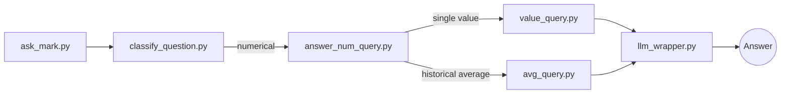

---
output:
  html_document: default
  pdf_document: default
---
## 1. 🧠 Introduction

**Mark – Your Personal AI Investment Assistant** is an intelligent financial assistant designed to provide accurate answers to user queries regarding financial markets and company fundamentals. This project serves as a university assignment but aspires to simulate the architecture of a production-grade AI system, combining structured financial data with natural language processing and Retrieval-Augmented Generation (RAG).

Mark is designed with the primary objective of helping users—such as investors, analysts, or students—query a vast database of U.S. publicly traded companies and receive informative, source-based answers in natural language. The assistant currently supports two core functionalities:

1. **Numerical Querying via Yahoo Finance**  
   Mark extracts and continuously updates structured financial and market data from Yahoo Finance for over 10,000 U.S.-listed companies. These data are stored in a normalized MySQL database, which supports fast and efficient SQL querying. When a user submits a question such as *"What was Apple's average stock price in 2022?"*, the system parses the query, extracts relevant entities (company, metric, time period), and generates an appropriate SQL query to fetch the result. The value is then passed through a response wrapper that contextualizes it into a natural, human-readable answer.

2. **Textual Question Answering via SEC Filings (10-K, 10-Q)**  
   In parallel, Mark allows users to ask qualitative questions based on official company disclosures. The system automatically downloads HTML-formatted 10-K and 10-Q reports from the SEC's EDGAR database, cleans and processes the documents, splits them into semantically meaningful chunks, embeds them into a FAISS vector store, and enables semantic search through a RAG pipeline. When a question is asked—e.g., *"What does the latest 10-K of Amazon say about risk factors?"*—Mark retrieves the most relevant text blocks and constructs an answer based entirely on official sources.

The system is modular and extensible, designed around a clean pipeline structure. The core orchestrator is the script `ask_mark.py`, which routes the user question to either the **numerical pipeline**, the **textual pipeline**, or a **hybrid path** depending on the nature of the query. Each component—classification, parsing, querying, retrieval, and response generation—has been implemented as an isolated, testable module.

Mark is deployed on a VPS environment, and its database is kept up to date via scheduled tasks (`crontab`) that ensure real-time accuracy of market and fundamental data. The user interface is exposed through a lightweight Streamlit web application, allowing anyone with browser access to interact with the assistant in real-time.

This README serves as a comprehensive guide for understanding, installing, deploying, and using the Mark assistant. Whether you're running the system locally or hosting it on a server, all necessary steps are detailed below.


## 2. 📌 Mark Pipeline Architecture  
```
                ┌───────────────────┐
                │   ask_mark.py     │ ← receives user question
                └─────────┬─────────┘
                          │
                ┌─────────▼─────────────┐
                │ classify_question.py  │ ← decides query type
                └───────┬───────┬───────┘
                        │       │
           ┌────────────▼─┐   ┌─▼───────────────┐
           │   Numerical  │   │     Textual     │
           │     Query    │   │      Query      │
           │(YahooFinance)│   │ (EDGAR Reports) │
           └──────┬───────┘   └──────┬──────────┘
                  │                  │
         ┌────────▼──────────┐ ┌─────▼──────────────┐
         │answer_num_query.py│ │answer_text_query.py│
         │     (routing)     │ └──────────────────┬─┘
         └─────┬───────┬─────┘                    │
               │       │                          │
┌──────────────▼───┐┌──▼───────────────┐          │
│parse_num_query.py││parse_avg_query.py│          │
│     (single)     ││    (averages)    │          │
└──────┬───────────┘└──────┬──────────┘           │
       │                   │                      │
┌──────▼────────┐ ┌────────▼───────┐  ┌───────────▼──────────┐
│value_query.py │ │avg_query.py    │  │    retriever.py      │
│ (SQL queries) │ │(SQL queries)   │  │   (semantic RAG)     │
└──────┬────────┘ └───────┬────────┘  └───────────┬──────────┘
       │                  │                       │
       │                  │                       │
       └──────────────────┴─┬─────────────────────┘
                            │
                            │               
               ┌────────────▼──────────────┐
               │       llm_wrapper.py      │
               │      (response LLM)       │
               └────────────┬──────────────┘
                            │
               ┌────────────▼────────────┐
               │      Final Answer       │ ← returned to user
               └─────────────────────────┘
```


## 3. Installation & Setup

### 3.1 Requirements

| Environment | Minimum Version |
| ----------- | --------------- |
|             |                 |

| **Operating System** | Ubuntu 20.04 LTS (tested on macOS 14) |
| -------------------- | ------------------------------------- |
| **Python**           | 3.11                                  |
| **MySQL**            | 8.0                                   |
| **GCC**              | 9 + (required for `faiss-cpu`)        |

> **Tip:** For a full 10 000‑ticker mirror, allocate at least **4 vCPU** and **8 GB RAM**.

---

### 3.2 Creating the Environment

```bash
git clone https://github.com/<your-username>/mark-ai-assistant.git
cd mark-ai-assistant

# Isolated virtual environment
python -m venv .venv
source .venv/bin/activate

# CPU‑only install
pip install -r requirements.txt
# or, for the full development stack (docs, linting, tests):
pip install -r requirements_full.txt
```

---

### 3.3 Configuring `.env`

1. Copy the template:

   ```bash
   cp .env.template .env
   ```

2. Fill in the variables:

   | Variable                                       | Description                                   |
   | ---------------------------------------------- | --------------------------------------------- |
   | `DB_HOST`, `DB_USER`, `DB_PASSWORD`, `DB_PORT` | MySQL credentials                             |
   | `OPENAI_API_KEY`                               | Your personal **super‑key** for OpenAI models |

3. Example snippet:

   ```ini
   # Database
   DB_HOST=localhost
   DB_PORT=3306
   DB_USER=mark_admin
   DB_PASSWORD=strong_password

   # OpenAI
   OPENAI_API_KEY=sk-XXXXXXXXXXXXXXXXXXXXXXXXXXXXXXX
   ```

`python-dotenv` loads the file automatically at runtime. In production the file usually lives in `$HOME/mark_ai/.env`.

---

### 3.4 Verifying the Installation (Optional)

```bash
# Activate the environment (if not already)
source .venv/bin/activate

# Quick health‑check – import core deps
python - <<'PY'
import dotenv, openai
print("✔️  Core Python dependencies available")
PY

# Check CLI entry‑point
python scripts/ask_mark.py --help
```

If the help screen appears without errors, the stack is ready.

---

### 3.5 What’s Next?

Proceed to [**4. Database Creation & Population**](#4-database-creation--population) to bootstrap the MySQL schema and fetch the initial data snapshot.

---

## 4. Database Creation & Population

### 4.1 Database Schema Overview

Mark uses a **normalized MySQL 8 schema** split into three logical groups:

| Schema         | Purpose                | Key Columns                                                             |
| -------------- | ---------------------- | ----------------------------------------------------------------------- |
| `company`      | static metadata        | `ticker` (PK), `cik`, `sector`, `industry`                              |
| `market_data`  | OHLC + volume (daily)  | (`ticker`, `date`) PK, `open`, `close`, `adj_close`, `volume`           |
| `fundamentals` | quarterly fundamentals | (`ticker`, `fiscal_date`) PK, `revenue`, `net_income`, `eps_diluted`, … |

*Foreign‑key constraints* ensure referential integrity, while **composite indexes** on `(ticker, date)` and `(ticker, fiscal_date)` keep analytical queries below \~20 ms.

---

### 4.2 Initializing the Schema — `create_mark_db.py`

This script creates the entire schema in one go.

```bash
# From the project root
source .venv/bin/activate
python scripts/db/create_mark_db.py
```

Parameters are read from `.env`. If the database already exists, the script exits gracefully without dropping any tables.

---

### 4.3 Populating & Updating — `update_mark_db.py`

`update_mark_db.py` pulls historical and latest data from **Yahoo Finance** for every ticker and performs an **upsert** (insert or update) into `market_data` and `fundamentals`.

```bash
python scripts/db/update_mark_db.py --start 2010-01-01 --batch-size 500
```

Key features :

- **Batching** – adjustable `--batch-size` keeps memory under control.
- **Delta checks** – only new rows are fetched if the symbol already exists.
- **Multiprocessing** – spawns workers equal to the number of CPU cores.

#### Automating with `cron`

```cron
# Update every night at 03:00 server time
0 3 * * * cd /home/mark && \ 
  source .venv/bin/activate && \ 
  python scripts/db/update_mark_db.py >> logs/update_db.log 2>&1
```

Logs are rotated weekly via `logrotate` (see `infra/logrotate.conf`).

---

### 4.4 Retrieving the Ticker Universe — `get_company_list.py`

Before any data can be pulled, the project needs a **valid list of tickers ↔ CIKs**. Run:

```bash
python scripts/db/get_company_list.py --out data/company_list.csv
```

The script:

1. Downloads the full mapping from the SEC EDGAR API.
2. Filters out non‑equity instruments (ETFs, bonds, ADRs).
3. Saves a de‑duplicated CSV with \~10 000 common stocks.

> **Tip:** Re‑run this script monthly to catch new IPOs or delistings.

---

### 4.5 Quick Consistency Check

```bash
mysql -u $DB_USER -p$DB_PASSWORD -h $DB_HOST -D mark_db -e "\nSELECT COUNT(*) AS rows_market,\n       (SELECT COUNT(*) FROM fundamentals) AS rows_fundamentals\nFROM market_data;"
```

A non‑zero count in both columns confirms that the mirror completed successfully.

## 5. Numerical Pipeline — Market & Fundamentals

### 5.1 Flow Overview

The numerical pipeline transforms a plain‑English financial question into a **parameterized SQL query** and returns a human‑readable answer:



### 5.2 Module Responsibilities

| Module | Core Responsibility |
| --- | --- |
| `answer_num_query.py` | Detect the **intent**: single value vs. average (future: ranking, comparison, distribution). |
| `parse_num_query.py` | Extract entities `Company`, `Metric`, `Date` for *single‑value* requests. |
| `parse_avg_query.py` | Extract entities plus **window** (`YEAR`, `QUARTER`, custom ranges) for averages. |
| `value_query.py` | Build and execute a **parameterized SELECT**; returns one scalar. |
| `avg_query.py` | Execute a `GROUP BY` or `WINDOW` aggregate query; returns one scalar. |
| `llm_wrapper.py` | Wrap the raw number into a concise, source‑cited sentence. |

### 5.3 Parsing Logic

All parsing is rule‑based with **regex + spaCy NER** for robustness:

1. **Ticker / Company Match:** cross‑checks against the `company` table and common aliases ("Alphabet" → `GOOGL`).
2. **Metric Dictionary:** maps synonyms ("earnings" → `net_income`).
3. **Temporal Normalizer:** resolves "last quarter" → `2025‑Q1`, etc.

> **Planned upgrade:** migrate to a lightweight transformer classifier for complex phrasings.

### 5.4 SQL Templates

```sql
-- Single value
SELECT {{ metric }}
FROM market_data
WHERE ticker = :ticker
  AND date = :target_date;

-- Average window
SELECT AVG({{ metric }}) AS avg_metric
FROM fundamentals
WHERE ticker = :ticker
  AND fiscal_date BETWEEN :start AND :end;
```

*Parameters* are safely bound via SQLAlchemy Core to prevent injection.

### 5.5 Performance Notes

- Composite indexes keep most single‑row lookups under **15 ms**.
- Average queries scan at most 60 rows (15 years × 4 quarters) — negligible.
- On a 4 vCPU VPS the full round‑trip **question → answer** averages **~250 ms**.

---


## 6. Textual Pipeline — SEC Filings & RAG

### 6.1 Flow Overview

The textual pipeline turns a qualitative question (e.g. *“What does Tesla’s 2024 10‑K say about supply‑chain risks?”*) into an **evidence‑grounded answer** using Retrieval‑Augmented Generation (RAG):

```mermaid
flowchart LR
  A[ask_mark.py] --> B[classify_question.py]
  B -- textual --> C[answer_text_query.py]
  C --> D[retriever.py (FAISS)]
  D --> E[llm_wrapper.py]
  E --> F((Answer))
```

### 6.2 Data Preparation Workflow

| Step | Script                      | Output Folder        | Purpose                                      |
| ---- | --------------------------- | -------------------- | -------------------------------------------- |
| 1    | `get_company_list.py`       | `data/`              | CSV mapping Ticker ↔ CIK (≈ 10 k rows)       |
| 2    | `download_edgar_reports.py` | `data/edgar_html/`   | Raw 10‑K / 10‑Q HTML per company             |
| 3    | `extract_text.py`           | `data/clean_txt/`    | Stripped text, one file per filing           |
| 4    | `chunk_text.py`             | `data/chunks_jsonl/` | JSONL chunks (\~400 tokens, paragraph‑aware) |
| 5    | `embed_and_index.py`        | `data/faiss_index/`  | FAISS index + metadata sqlite                |

> Each stage is **idempotent**: rerunning a step updates only new or changed filings.

### 6.3 Retrieval & Answer Generation

1. **Retriever (**\`\`**)** performs a max‑inner‑product search on the FAISS index and returns the top‑`k` (default 3) chunks.
2. **LLM wrapper (**\`\`**)** assembles a prompt: *user query + retrieved chunks + formatting rules*.
3. GPT‑4 (or GPT‑4o) generates a concise answer **with inline citations** (`[SEC‑23]`).

```python
answer = llm_wrapper(
    question="What are Apple’s major risk factors?",
    context_chunks=list_of_chunks,
    model="gpt-4o"
)
```

### 6.4 Embedding Configuration

| Parameter       | Value                                 |
| --------------- | ------------------------------------- |
| Model           | `text-embedding-ada-002` (1 536 dims) |
| Normalization   | L2 (unit vector)                      |
| Index Type      | FAISS `IndexIVFFlat` (nlist = 4096)   |
| Distance Metric | Inner Product                         |

*Future work:* evaluate **MiniLM‑based** embeddings to reduce cost and provide on‑prem fallback.

### 6.5 Performance & Limitations

- **Corpus size:** ≈ 120 k filings → \~15 M chunks (\~9 GB index).
- **Retrieval latency:** \~150 ms (cold) / \~40 ms (warm) on a 4 vCPU VPS.
- **End‑to‑end response:** \~350 ms including LLM generation (8 k context).
- **Known limitations:**
  - Filings older than 10 years are currently excluded.
  - Non‑HTML exhibits (PDF) are skipped; support planned.
  - Answers are **as‑of** the latest available filing; mark doesn’t infer future events.

---

## 7. Web Interface

### 7.1 Launching the Streamlit App

```bash
# From the project root
source .venv/bin/activate
streamlit run web/mark_streamlit_app.py --server.port 8501
```

By default Streamlit binds to `localhost:8501`. Use the `--server.address 0.0.0.0` flag when running on a remote VPS.

### 7.2 UI Layout

| Area               | Description                                                                                             |
| ------------------ | ------------------------------------------------------------------------------------------------------- |
| **Sidebar**        | language selector, model temperature slider, pipeline toggle (*numeric / textual / auto*), theme switch |
| **Main Chat Pane** | conversational thread rendered with markdown, code blocks, and tables                                   |
| **Citation Panel** | expandable section below each answer showing chunk sources (SEC hyperlinks)                             |


> **Tip:** Streamlit’s hot‑reload lets you tweak the UI live; simply edit `mark_streamlit_app.py` and save.

### 7.3 Session State & Persistence

The app uses `st.session_state` to keep:

- **Chat history** (questions + answers)
- **Current language** (English / Italian)
- **Temperature & pipeline mode**

History resets on browser refresh. For persistent storage attach a lightweight key‑value store (e.g. Redis) behind the same API.

### 7.4 Environment Variables for the Web Layer

| Variable           | Default | Purpose                                     |
| ------------------ | ------- | ------------------------------------------- |
| `WEB_PORT`         | `8501`  | Default port override                       |
| `DEFAULT_PIPELINE` | `auto`  | Initial mode (`numeric`, `textual`, `auto`) |
| `DEFAULT_LANG`     | `en`    | UI language                                 |

These can be exported before launching, e.g. `export WEB_PORT=8080`.

### 7.5 Reverse Proxy & HTTPS (Nginx)

```nginx
server {
    listen 443 ssl;
    server_name mark.yourdomain.com;

    ssl_certificate     /etc/letsencrypt/live/mark/fullchain.pem;
    ssl_certificate_key /etc/letsencrypt/live/mark/privkey.pem;

    location / {
        proxy_pass         http://127.0.0.1:8501;
        proxy_set_header   Host $host;
        proxy_set_header   X-Real-IP $remote_addr;
        proxy_set_header   X-Forwarded-For $proxy_add_x_forwarded_for;
        proxy_set_header   X-Forwarded-Proto $scheme;
    }
}
```

After reloading Nginx (`sudo systemctl reload nginx`), Mark’s UI will be accessible via [**https://mark.yourdomain.com**](https://mark.yourdomain.com).

---

## 8. Deployment

### 8.1 Local (Developer) Mode

Running everything on your laptop is the quickest way to experiment and iterate.

#### 8.1.1 CLI‑Only

```bash
source .venv/bin/activate
python scripts/ask_mark.py  
# → type questions directly in the terminal
```

#### 8.1.2 Streamlit UI

```bash
source .venv/bin/activate
streamlit run web/mark_streamlit_app.py --server.port 8501
```

Open [http://localhost:8501](http://localhost:8501) and start chatting.

> **Note:** The numerical pipeline requires an initialized database (see section 4). If the database is empty, numerical questions will return a polite “no data” notice.

---

### 8.2 Production on a VPS (Ubuntu 20.04)

| Task                | Tool / File                             | Notes                                              |
| ------------------- | --------------------------------------- | -------------------------------------------------- |
| Create service user | `sudo adduser --disabled‑password mark` | avoids running as *root*                           |
| Clone repo          | `/home/mark/mark-ai-assistant`          | owner `mark:mark`                                  |
| Python env          | `.venv` as in § 3                       |                                                    |
| Environment         | `/home/mark/.env`                       | identical to local config                          |
| Database            | MySQL 8 on same VPS **or** managed RDS  | ensure `bind-address 127.0.0.1` for local installs |
| Reverse proxy       | Nginx TLS terminator                    | see § 7.5                                          |
| Background service  | **systemd**                             | unit file below                                    |

#### 8.2.1 Systemd unit – *mark.service*

```ini
[Unit]
Description=Mark AI Investment Assistant – Streamlit Service
After=network.target

[Service]
User=mark
WorkingDirectory=/home/mark/mark-ai-assistant
Environment="PYTHONUNBUFFERED=1"
EnvironmentFile=/home/mark/.env
ExecStart=/home/mark/mark-ai-assistant/.venv/bin/streamlit run web/mark_streamlit_app.py --server.port 8501 --server.address 0.0.0.0
Restart=on-failure
RestartSec=5s

[Install]
WantedBy=multi-user.target
```

Enable and start:

```bash
sudo systemctl daemon-reload
sudo systemctl enable mark
sudo systemctl start mark
sudo systemctl status mark -n 20   # tail logs
```

The service auto‑restarts on crashes and boots with the VPS.

---

### 8.3 Docker (Optional)

A Docker setup simplifies onboarding but is not strictly required. A minimal *docker-compose.yml* is provided in `infra/docker-compose.yml` (commented). Example:

```yaml
version: "3.9"
services:
  mark:
    build: .
    ports:
      - "8501:8501"
    env_file:
      - .env
    restart: unless-stopped
```

Build & run:

```bash
docker compose up --build -d
```

---

### 8.4 Monitoring & Logs

| Aspect           | Tool                                  | Location                  |
| ---------------- | ------------------------------------- | ------------------------- |
| Application logs | `systemd` journal + `logrotate`       | `/var/log/mark/`          |
| Database health  | `mysqltuner` weekly cron              | `/var/log/mysqltuner.log` |
| Metrics          | optional **Prometheus Node Exporter** | port 9100                 |
| Dashboards       | **Grafana** (docker)                  | port 3000                 |

Set up alerts (e.g. E‑mail/Slack) for:

- DB replication lag > 30 s
- LLM latency > 2 s (95th percentile)
- HTTP 5xx rate > 1 % over 5 min

---

Deployment is complete—Mark is now live and serving financial insights!

## 9. User Guide (Quick Start)

### 9.1 Numerical Questions

Ask for **single values** or **historical averages** based on Yahoo Finance data.

| Example Question                                    | Result                         |
| --------------------------------------------------- | ------------------------------ |
| *“What was Apple’s closing price on 2024‑12‑31?”*   | `$193.25` (single value)       |
| *“Average quarterly revenue of Microsoft in 2023?”* | `$55.3 B` (historical average) |

**Tips**

- Use natural language; Mark recognises synonyms (*“earnings”*, *“net profit”* → `net_income`).
- Specify explicit dates (`YYYY‑MM‑DD`) for faster resolution.
- If you omit the date, Mark assumes the **latest trading day**.

```bash
# CLI usage
> What was NVIDIA's EPS in Q1 2025?
```

---

### 9.2 Textual Questions

Retrieve insights directly from **SEC filings** (10‑K / 10‑Q).

| Example Question                                                | What Happens                                                                      |
| --------------------------------------------------------------- | --------------------------------------------------------------------------------- |
| *“Summarise Tesla’s 2024 10‑K risk factors.”*                   | Mark fetches top‑k chunks, then GPT‑4 replies with a bullet list & SEC citations. |
| *“Does Amazon mention climate initiatives in its latest 10‑Q?”* | Answer cites the paragraph and links to the filing.                               |

**Tips**

- Reference a **specific filing year** when possible (e.g. *“2023 10‑K”*).
- Mark currently indexes the last **10 years** of filings.
- Inline citations like `[SEC‑17]` open the exact section in a new tab.

---

### 9.3 Hybrid Questions

Combine both pipelines:

> *“Give me Apple’s FY‑2024 net income and list the main risk factors.”*

Mark responds with a **numeric value** plus a **textual summary**—each sourced independently.

---

### 9.4 Troubleshooting & FAQ

| Symptom                        | Likely Cause                               | Fix                                             |
| ------------------------------ | ------------------------------------------ | ----------------------------------------------- |
| “No data available”            | DB not populated or date out of range      | Run `update_mark_db.py` or adjust date          |
| “No relevant SEC chunks found” | Filing year < 2014 or company not in index | Refresh filings via `download_edgar_reports.py` |
| High latency (>2 s)            | LLM or DB under load                       | Check server CPU/RAM, consider scaling          |

---

### 9.5 Keyboard Shortcuts (Streamlit UI)

| Shortcut       | Action                     |
| -------------- | -------------------------- |
| `Ctrl + Enter` | Send question              |
| `Ctrl + L`     | Clear chat history         |
| `/` then type  | Invoke **command palette** |

---

Happy querying! Feel free to open an issue on GitHub if you run into problems or have feature requests.


